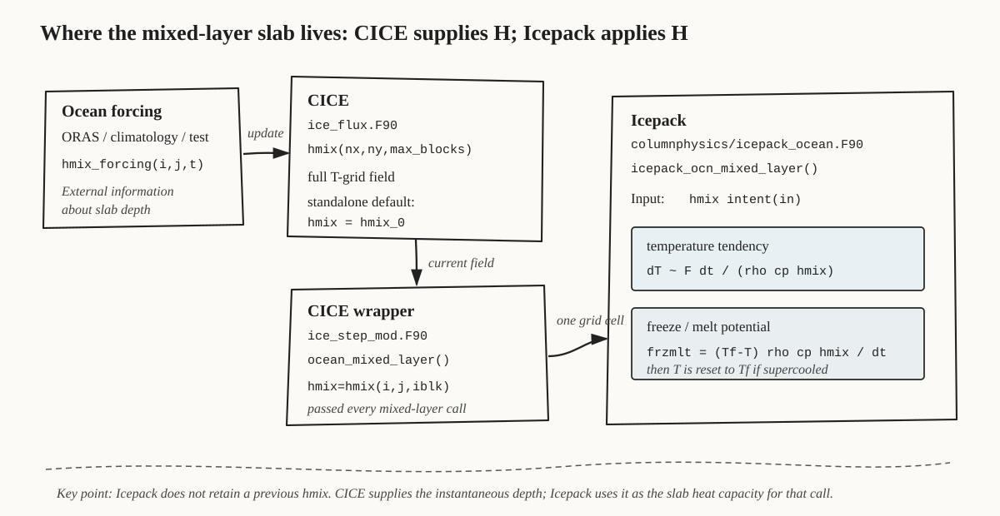
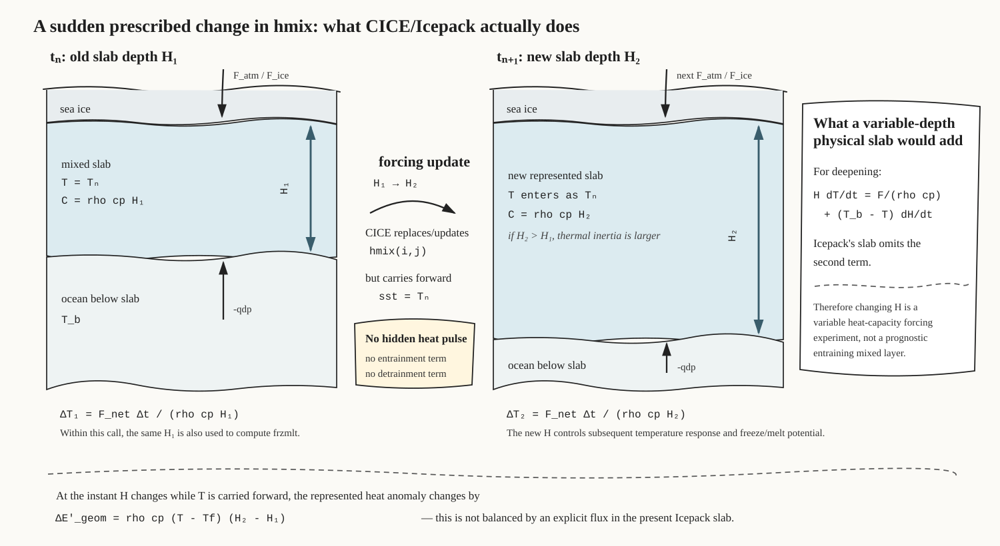

# Dynamic ORAS-derived mixed-layer depth in CICE

## Purpose

This project tests whether Antarctic fast-ice growth, persistence and seasonal timing are sensitive to realistic spatial and temporal variation in upper-ocean mixed-layer depth (MLD). The first implementation should remain deliberately simple: prescribe `hmix(i,j,t)` from ORAS-derived fields and pass it through the existing CICE → Icepack mixed-layer pathway without rewriting Icepack thermodynamics.

The central distinction is important:

> **The existing Icepack ocean mixed-layer scheme can accept a different `hmix` on successive calls, but it is a slab heat-capacity scheme, not a prognostic entraining mixed-layer model.**

Changing `hmix` is therefore possible and scientifically interpretable, provided the first experiment is described correctly: it changes the represented ocean thermal mass beneath the ice. It does **not** explicitly account for the heat and salt associated with entrainment or detrainment when the prescribed mixed-layer base moves.

This document first establishes exactly where the scheme resides in Icepack, where `hmix` resides in CICE, how the two are connected, and what occurs when `hmix` changes between timesteps. The ORAS experiment design follows from that conceptual analysis.

---

## 1. Where the mixed-layer scheme actually lives

The CICE branch used here is linked to the Icepack submodule at commit:

```text
Icepack commit: a5b5ebe63f986dbda86d5b2ef91426811619d018
```

The relevant implementation is split cleanly between CICE and Icepack:

- **CICE owns the gridded field** `hmix(i,j,iblk)` and supplies forcing.
<<<<<<< HEAD
- **CICE calls Icepack** for each thermodynamic grid cell through `ocean_mixed_layer()`.
=======
- **CICE calls Icepack** once for each thermodynamic grid cell through `ocean_mixed_layer()`.
>>>>>>> 4fdbcc7 (floedim experiment and new documentation on experimenting with mixed layer depth in standalone CICE)
- **Icepack consumes the instantaneous `hmix` value** and uses it in the slab heat balance and freeze/melt-potential calculation.
- Icepack does not carry a separate previous mixed-layer depth and does not calculate `dhmix/dt`.



### 1.1 Icepack: `icepack_ocn_mixed_layer`

The mixed-layer heat-balance routine is:

```text
icepack/columnphysics/icepack_ocean.F90
    module icepack_ocean
        subroutine icepack_ocn_mixed_layer(...)
```

In this routine, `hmix` is an input argument:

```fortran
real (kind=dbl_kind), intent(in) :: &
   ...
   hmix      , & ! mixed layer depth (m)
   ...
   dt            ! time step (s)
```

That is the first key point: **`hmix` is not an Icepack prognostic state variable in this scheme**. Icepack receives the value supplied by CICE for the current call.

The surface/ice/deep-ocean heat fluxes change SST according to:

```fortran
sst = sst + dt * ( &
      (fsens_ocn + flat_ocn + flwout_ocn + flw + swabs) * (c1-aice) &
    + fhocn + fswthru) &
    / (cprho*hmix)

sst = sst - qdp*dt/(cprho*hmix)
```

Schematically,

\[
\Delta T = \frac{F_{net}\,\Delta t}{\rho c_p H},
\]

<<<<<<< HEAD
where \(H=hmix\) and \(\rho c_pH\) is the heat capacity per unit horizontal area of the represented ocean slab. Thus, for the same heat flux, a shallower mixed layer changes temperature more rapidly and a deeper mixed layer more slowly.
=======
where

- \(H = hmix\),
- \(\rho c_p H\) is the heat capacity per unit horizontal area of the represented ocean slab,
- \(F_{net}\) is the net combination of atmospheric, ice-ocean, penetrating-shortwave and deep-ocean heat fluxes using the CICE/Icepack sign conventions.

Thus, for the same heat flux:

- a **shallower** mixed layer changes temperature more rapidly;
- a **deeper** mixed layer changes temperature more slowly.
>>>>>>> 4fdbcc7 (floedim experiment and new documentation on experimenting with mixed layer depth in standalone CICE)

Icepack then computes the energy available for freezing or melting:

```fortran
frzmlt = (Tf-sst)*cprho*hmix/dt
frzmlt = min(max(frzmlt,-frzmlt_max),frzmlt_max)

if (sst <= Tf) sst = Tf
```

The same current `hmix` is therefore used both to calculate the SST tendency and to convert any supercooling relative to `Tf` into a freezing potential.

### 1.2 CICE: `hmix` is a full T-grid field

CICE declares `hmix_0` as the initial/fixed standalone depth and `hmix` as a three-dimensional block field in:

```text
cicecore/cicedyn/general/ice_flux.F90
```

Conceptually:

```fortran
real(kind=dbl_kind), public :: &
   hmix_0         ! initial (or fixed if standalone) mixed layer depth

real(kind=dbl_kind), dimension(:,:,:), allocatable, public :: &
   ...
   hmix    , &     ! mixed layer depth (m)
   ...
```

The standalone initialization sets:

```fortran
hmix(:,:,:) = hmix_0
```

This is an implementation choice in the forcing/setup path, not a scalar limitation in Icepack.

### 1.3 CICE → Icepack: the instantaneous grid-cell value is passed on every call

The CICE wrapper is:

```text
cicecore/cicedyn/general/ice_step_mod.F90
    subroutine ocean_mixed_layer(dt, iblk)
```

<<<<<<< HEAD
For each thermodynamic grid cell it calls Icepack with the current value:
=======
For each thermodynamic grid cell it calls Icepack with:
>>>>>>> 4fdbcc7 (floedim experiment and new documentation on experimenting with mixed layer depth in standalone CICE)

```fortran
call icepack_ocn_mixed_layer( &
     ...
     hmix  = hmix(i,j,iblk), &
     Tf    = Tf  (i,j,iblk), &
     qdp   = qdp (i,j,iblk), &
     frzmlt= frzmlt(i,j,iblk), &
     dt    = dt)
```

There is no requirement in that interface that the value supplied at timestep \(n+1\) equal the value supplied at timestep \(n\).

### 1.4 Time-varying MLD is already represented in the CICE forcing architecture

The existing NCAR-style ocean forcing pathway in:

```text
cicecore/cicedyn/general/ice_forcing.F90
```

<<<<<<< HEAD
includes:
=======
includes the field list:
>>>>>>> 4fdbcc7 (floedim experiment and new documentation on experimenting with mixed layer depth in standalone CICE)

```fortran
data vname / 'T', 'S', 'hblt', 'U', 'V', 'dhdx', 'dhdy', 'qdp' /
```

<<<<<<< HEAD
and maps `hblt` into CICE `hmix`. This is useful evidence about the intended architecture: a spatially and temporally varying mixed-layer depth is not foreign to the CICE → Icepack interface.
=======
and maps the boundary/mixed-layer depth field (`hblt`) into CICE `hmix`.

This is useful evidence about the intended architecture: a spatially and temporally varying mixed-layer depth is not foreign to the CICE → Icepack interface.
>>>>>>> 4fdbcc7 (floedim experiment and new documentation on experimenting with mixed layer depth in standalone CICE)

However, the legacy NCAR pathway imposes a lower bound equivalent to the default mixed-layer depth:

```fortran
hmix(i,j,iblk) = max(mixed_layer_depth_default, work1(i,j,iblk))
```

<<<<<<< HEAD
with `mixed_layer_depth_default = 60 m` in this source tree. **That 60-m floor should not be copied into the ORAS Antarctic experiment.** It would remove much of the shallow coastal and summer MLD variability that this experiment is intended to test. The ORAS pathway should instead use explicit, scientifically chosen `hmix_min`, `hmix_max`, and bathymetry-aware limits.
=======
with `mixed_layer_depth_default = 60 m` in this source tree. **That 60-m floor should not be copied into the ORAS Antarctic experiment.** It would remove much of the shallow coastal and summer MLD variability that this experiment is intended to test. The ORAS pathway should instead use an explicit, scientifically chosen `hmix_min`, `hmix_max`, and bathymetry-aware limit.
>>>>>>> 4fdbcc7 (floedim experiment and new documentation on experimenting with mixed layer depth in standalone CICE)

---

## 2. What happens if `hmix` changes suddenly between timesteps?

<<<<<<< HEAD
The most transparent thought experiment is deliberately severe: CICE uses \(H_1\) at timestep \(n\), then the forcing system changes `hmix` to \(H_2\) before timestep \(n+1\).



An editable TikZ version of this figure is retained at `figures/tikz/mixed-layer-step-change.tex`; GitHub Markdown itself does not compile TikZ, hence the SVG used above.

=======
The most useful thought experiment is deliberately severe: suppose CICE uses \(H_1\) at timestep \(n\), then the forcing system changes `hmix` to \(H_2\) before timestep \(n+1\).


>>>>>>> 4fdbcc7 (floedim experiment and new documentation on experimenting with mixed layer depth in standalone CICE)
### 2.1 Timestep \(n\): Icepack uses \(H_1\)

At timestep \(n\), Icepack receives:

```text
sst  = T_n
hmix = H_1
```

and applies the heat fluxes using heat capacity

\[
<<<<<<< HEAD
C_1=\rho c_pH_1.
=======
C_1 = \rho c_p H_1.
>>>>>>> 4fdbcc7 (floedim experiment and new documentation on experimenting with mixed layer depth in standalone CICE)
\]

For a net heat input \(F_{net}\),

\[
<<<<<<< HEAD
\Delta T_1=\frac{F_{net}\Delta t}{\rho c_pH_1}.
=======
\Delta T_1 = \frac{F_{net}\Delta t}{\rho c_p H_1}.
>>>>>>> 4fdbcc7 (floedim experiment and new documentation on experimenting with mixed layer depth in standalone CICE)
\]

If cooling takes SST below the freezing point, the same \(H_1\) is used in the calculation of `frzmlt` before SST is reset to `Tf`.

<<<<<<< HEAD
### 2.2 Between timesteps: CICE changes \(H_1\rightarrow H_2\)
=======
### 2.2 Between timesteps: CICE changes \(H_1 \rightarrow H_2\)
>>>>>>> 4fdbcc7 (floedim experiment and new documentation on experimenting with mixed layer depth in standalone CICE)

If external forcing changes:

```text
hmix: H_1 -> H_2
```

<<<<<<< HEAD
CICE does **not** automatically apply a compensating heat flux associated with that change in represented slab volume. The SST state is carried forward in the normal way, and on the next call Icepack simply receives the new depth.

There is no hidden operation of the form:
=======
CICE does **not** automatically apply a compensating heat flux associated with that change in slab volume.

The SST state is simply carried forward in the normal way. At the next Icepack call the model sees, schematically:

```text
sst  = T_n+1 carried from the previous model state
hmix = H_2 supplied by CICE forcing
```

There is no hidden Icepack operation of the form:
>>>>>>> 4fdbcc7 (floedim experiment and new documentation on experimenting with mixed layer depth in standalone CICE)

```text
new MLD -> entrain water -> mix temperature -> conserve mixed-layer heat content
```

and no corresponding detrainment operation if the layer becomes shallower.

<<<<<<< HEAD
This distinction is critical: there is no numerical instability implied simply by changing `hmix`, but neither is there a hidden physical mechanism that accounts for the energetic consequence of moving the mixed-layer base.

=======
>>>>>>> 4fdbcc7 (floedim experiment and new documentation on experimenting with mixed layer depth in standalone CICE)
### 2.3 Timestep \(n+1\): Icepack uses \(H_2\)

At the next call the heat capacity is simply

\[
<<<<<<< HEAD
C_2=\rho c_pH_2,
=======
C_2 = \rho c_p H_2,
>>>>>>> 4fdbcc7 (floedim experiment and new documentation on experimenting with mixed layer depth in standalone CICE)
\]

so subsequent forcing produces

\[
<<<<<<< HEAD
\Delta T_2=\frac{F_{net}\Delta t}{\rho c_pH_2}.
\]

If \(H_2>H_1\), the model has changed to a larger represented thermal reservoir and subsequent SST tendencies are smaller for a given flux. If \(H_2<H_1\), the represented thermal reservoir is smaller and subsequent SST tendencies are larger.

This is numerically well defined. The physical question is what is omitted at the instant the represented slab depth changes.
=======
\Delta T_2 = \frac{F_{net}\Delta t}{\rho c_p H_2}.
\]

If \(H_2 > H_1\), the model has instantaneously changed to a larger represented thermal reservoir and subsequent SST tendencies are smaller for a given flux. If \(H_2 < H_1\), the represented thermal reservoir is smaller and subsequent SST tendencies are larger.

This is numerically well defined. The important physical question is what is omitted at the instant the represented slab depth changes.
>>>>>>> 4fdbcc7 (floedim experiment and new documentation on experimenting with mixed layer depth in standalone CICE)

---

## 3. Energy interpretation of a changing prescribed slab

<<<<<<< HEAD
### 3.1 Existing Icepack slab equation
=======
### 3.1 The existing Icepack slab equation
>>>>>>> 4fdbcc7 (floedim experiment and new documentation on experimenting with mixed layer depth in standalone CICE)

Ignoring sign-convention detail and collecting the explicit fluxes into \(F_{net}\), the existing scheme is approximately:

\[
<<<<<<< HEAD
H\frac{dT}{dt}=\frac{F_{net}}{\rho c_p}.
\]

The current value of \(H\) changes thermal inertia, but Icepack contains no explicit term involving \(dH/dt\).

### 3.2 Represented heat-content change when depth changes
=======
H\frac{dT}{dt} = \frac{F_{net}}{\rho c_p}.
\]

The current value of \(H\) changes the thermal inertia, but Icepack contains no explicit term involving \(dH/dt\).

### 3.2 Apparent heat-content change when the prescribed depth changes
>>>>>>> 4fdbcc7 (floedim experiment and new documentation on experimenting with mixed layer depth in standalone CICE)

A useful diagnostic is the mixed-layer sensible-heat anomaly relative to the local freezing temperature:

\[
<<<<<<< HEAD
E'_{ml}=\rho c_pH(T-T_f).
=======
E'_{ml} = \rho c_p H(T-T_f).
>>>>>>> 4fdbcc7 (floedim experiment and new documentation on experimenting with mixed layer depth in standalone CICE)
\]

If `hmix` changes instantaneously from \(H_1\) to \(H_2\) while temperature is carried forward, the represented heat anomaly changes by

\[
<<<<<<< HEAD
\Delta E'_{geom}=\rho c_p(T-T_f)(H_2-H_1).
\]

In the current slab scheme this change is **not** balanced by an explicit model heat flux. This is the cleanest statement of the limitation of a prescribed changing `hmix`.

Two qualifications matter:

1. If \(T\approx T_f\), then \(E'_{ml}\) and the geometric heat-anomaly jump can be small even for a substantial change in depth.
2. A deepening real mixed layer can nevertheless entrain water whose temperature differs from the existing slab, so the missing entrainment heat flux can still matter even when the surface layer is near freezing.
=======
\Delta E'_{geom}
= \rho c_p (T-T_f)(H_2-H_1).
\]

In the current slab scheme, this change is **not** balanced by an explicit model heat flux. This is the cleanest way to describe the limitation of a prescribed changing `hmix`.

Two qualifications matter:

1. If \(T \approx T_f\), then \(E'_{ml}\) and this geometric heat-anomaly jump can be small even for a substantial change in depth.
2. A deepening real mixed layer can nevertheless entrain water whose temperature differs from the existing slab, so the missing entrainment heat flux can still matter even when the surface layer itself is near freezing.
>>>>>>> 4fdbcc7 (floedim experiment and new documentation on experimenting with mixed layer depth in standalone CICE)

### 3.3 What a physically variable-depth mixed layer would add

For a simple deepening slab, a more complete temperature equation contains an entrainment term of the form

\[
H\frac{dT}{dt}
=
\frac{F_{net}}{\rho c_p}
+
(T_b-T)\frac{dH}{dt},
\qquad \frac{dH}{dt}>0,
\]

where \(T_b\) is the temperature of water incorporated from immediately beneath the mixed layer.

<<<<<<< HEAD
The corresponding entrainment heat-flux scale is

\[
Q_{ent}\approx\rho c_p(T_b-T_{ml})\max\left(\frac{dH}{dt},0\right).
\]

The present Icepack slab does not calculate this term. A complete prognostic treatment would additionally require salinity/buoyancy physics, and shoaling/detrainment requires its own physical treatment rather than simply applying the deepening expression with the opposite sign.

Therefore M1 should **not** be described as a prognostic mixed-layer experiment. It is more precisely:

> **a prescribed variable-depth slab experiment that tests sensitivity to changing upper-ocean heat capacity while omitting explicit entrainment/detrainment thermodynamics.**

### 3.4 Why this does not make M1 nonsensical

The omission above is a limitation, not an algebraic failure of the CICE/Icepack heat budget. Within each thermodynamic call:
=======
The corresponding entrainment heat flux scale is

\[
Q_{ent}
\approx
\rho c_p (T_b-T_{ml})\max\left(\frac{dH}{dt},0\right).
\]

The present Icepack slab does not calculate this term. A full prognostic mixed-layer treatment would also need salinity/buoyancy physics, and shoaling/detrainment requires its own interpretation rather than simply applying the deepening expression with the opposite sign.

Therefore M1 should **not** be described as a prognostic mixed-layer experiment. It is more precisely:

> **a prescribed variable-depth slab experiment that tests sensitivity to changing upper-ocean heat capacity, while omitting explicit entrainment/detrainment thermodynamics.**

### 3.4 Why this does not make M1 nonsensical

The omission above is a limitation, not an algebraic failure of the CICE/Icepack heat budget.

Within each thermodynamic call:
>>>>>>> 4fdbcc7 (floedim experiment and new documentation on experimenting with mixed layer depth in standalone CICE)

- one value of `hmix` is used consistently;
- all explicit heat-flux SST tendencies use that value;
- `frzmlt` uses the same value;
- the resulting SST/freezing calculation is well defined.

<<<<<<< HEAD
The experiment becomes physically questionable only if the omitted entrainment/detrainment energy is comparable to, or larger than, the explicit fluxes controlling the result. That is an empirical diagnostic question and can be quantified from ORAS temperature profiles.
=======
The experiment becomes questionable only if the omitted entrainment/detrainment energy is comparable to, or larger than, the explicit fluxes that control the result. That is an empirical diagnostic question and can be quantified from ORAS temperature profiles before moving to a more complex model.
>>>>>>> 4fdbcc7 (floedim experiment and new documentation on experimenting with mixed layer depth in standalone CICE)

---

## 4. Interaction with SST restoring in this CICE branch

The AFIM ocean-forcing pathway restores SST by Newtonian temperature relaxation:

```fortran
sst = sst + (sst_interp - sst) * dt / trest
```

The **temperature restoring timescale** therefore does not itself depend on `hmix`:

\[
<<<<<<< HEAD
\left.\frac{dT}{dt}\right|_{restore}=\frac{T_{ORAS}-T}{\tau}.
=======
\frac{dT}{dt}\bigg|_{restore}
= \frac{T_{ORAS}-T}{\tau}.
>>>>>>> 4fdbcc7 (floedim experiment and new documentation on experimenting with mixed layer depth in standalone CICE)
\]

However, the heat flux energetically equivalent to that temperature increment does depend on slab depth:

\[
<<<<<<< HEAD
Q_{restore}=\rho c_pH\frac{T_{ORAS}-T}{\tau}.
\]

Thus changing `hmix` does not change the specified restoring time \(\tau\), but it does change the amount of implied heat per unit area associated with a given restored temperature increment. `Q_restore` should therefore be diagnosed whenever restoring is active.
=======
Q_{restore}
= \rho c_p H\frac{T_{ORAS}-T}{\tau}.
\]

This distinction should be kept explicit when interpreting M1–M4:

- changing `hmix` does **not** change the specified restoring time \(\tau\);
- changing `hmix` **does** change the amount of implied heat per unit area associated with a given restored temperature increment.

`Q_restore` should therefore be diagnosed whenever SST restoring is active.
>>>>>>> 4fdbcc7 (floedim experiment and new documentation on experimenting with mixed layer depth in standalone CICE)

---

## 5. Implications for fast-ice growth and seasonality

A variable `hmix` should not be assumed to translate monotonically into faster or slower mid-winter basal growth.

<<<<<<< HEAD
If the slab is already at the local freezing temperature and a flux would supercool it, Icepack first produces a temperature tendency proportional to \(1/H\), then converts the resulting supercooling into `frzmlt` using a factor proportional to \(H\). To first order those dependencies can cancel:

\[
\Delta T\propto\frac{1}{H},
\qquad
F_{frz}\propto H\Delta T.
\]

The strongest MLD sensitivity may therefore appear where the slab contains sensible heat above freezing, particularly during:

- autumn cooling and freeze-up;
- shoulder-season thermal memory;
- spring warming and retreat;
- periods/regions with substantial subsurface heat;
- periods where SST restoring or `qdp` supplies substantial heat.

This is directly relevant to Antarctic landfast-ice seasonal timing, but it is a more precise mechanism than assuming simply that “shallower MLD means faster ice growth.”
=======
If the slab is already at the local freezing temperature and a flux would supercool it, Icepack first produces a temperature tendency proportional to \(1/H\), but then converts the resulting supercooling into `frzmlt` using a factor proportional to \(H\). To first order those dependencies can cancel:

\[
\Delta T \propto \frac{1}{H},
\qquad
F_{frz} \propto H\Delta T.
\]

The strongest MLD sensitivity may therefore appear in periods when the slab retains sensible heat above freezing, particularly:

- autumn cooling and freeze-up timing;
- shoulder-season thermal memory;
- spring warming and retreat timing;
- regions where subsurface heat is important;
- regions/times where SST restoring or `qdp` supplies substantial heat.

That is still directly relevant to Antarctic landfast-ice growth rate, persistence and seasonal timing, but it makes the expected mechanism more precise than simply assuming “shallower MLD = faster ice growth.”
>>>>>>> 4fdbcc7 (floedim experiment and new documentation on experimenting with mixed layer depth in standalone CICE)

---

## 6. Revised experiment staging

<<<<<<< HEAD
Do not begin with a full prognostic mixed-layer implementation. First determine whether realistic MLD variability materially affects the simple slab and whether the omitted entrainment term is first or second order.
=======
Do not begin with a full prognostic mixed-layer implementation. First determine whether the simple slab's response to realistic MLD variability is large enough to matter and whether the omitted entrainment heat term is first or second order.
>>>>>>> 4fdbcc7 (floedim experiment and new documentation on experimenting with mixed layer depth in standalone CICE)

| Stage | Name | Description | Interpretation |
|---|---|---|---|
| M0 | `fixed-control` | current fixed `hmix_0` and existing ocean pathway | baseline |
<<<<<<< HEAD
| M0S | `hmix-step-test` | short synthetic test with abrupt local changes, e.g. 20 → 80 m and reverse | verify numerical response and diagnostics; not a production experiment |
| M1 | `ORAS-hmix-14d` | ORAS MLD low-pass filtered on ~14-day scales and continuously interpolated to model timesteps | variable slab heat capacity, no explicit entrainment |
=======
| M0S | `hmix-step-test` | short synthetic test with a deliberately abrupt local change, e.g. 20 → 80 m and reverse | verify exact numerical response and diagnostics; **not** a production experiment |
| M1 | `ORAS-hmix-14d` | ORAS-derived MLD low-pass filtered on ~14-day scales and continuously interpolated to model timesteps | variable slab heat capacity, no explicit entrainment |
>>>>>>> 4fdbcc7 (floedim experiment and new documentation on experimenting with mixed layer depth in standalone CICE)
| M2 | `ORAS-hmix-daily` | daily ORAS MLD, continuously interpolated | higher-frequency variable slab heat capacity |
| M3 | `ORAS-hmix-clim` | climatological seasonal-cycle MLD | isolate seasonal MLD structure from IAV/weather noise |
| M4 | `ORAS-hmix-sstsss` | dynamic MLD plus ORAS SST/SSS restoring | add thermodynamic ocean-state constraint |
| M5 | `ORAS-hmix-uocn` | add surface or mixed-layer-mean ORAS currents | add ocean-dynamic forcing pathway |
| M6 | `entraining/prognostic-ML` | add entrainment/detrainment or a prognostic mixed-layer scheme only if M1–M5 justify it | physically evolving mixed layer |

<<<<<<< HEAD
### Why M1 should be filtered/interpolated rather than a 14-day staircase

The original concept of updating `hmix` every ~14 days is useful as a characteristic timescale, but there is little scientific benefit in imposing discrete 14-day jumps. A staircase creates artificial impulses in \(dH/dt\) and maximizes the unrepresented geometric/entrainment energy change at each update.
=======
### Why M1 should be filtered/interpolated rather than updated as a staircase

The original concept of updating `hmix` every ~14 days is useful as a timescale, but there is little scientific benefit in imposing discrete 14-day jumps. A staircase creates artificial impulses in \(dH/dt\) and maximizes the unrepresented geometric/entrainment energy change at each update.
>>>>>>> 4fdbcc7 (floedim experiment and new documentation on experimenting with mixed layer depth in standalone CICE)

The preferred M1 is therefore:

```text
ORAS MLD
  -> quality control / clipping
  -> ~14-day temporal low-pass or smoothing
  -> linear interpolation to every CICE thermodynamic timestep
  -> hmix(i,j,t)
```

<<<<<<< HEAD
M0S retains a deliberately sudden change as a transparent unit/physics test so the conceptual response above can be reproduced in the compiled model.
=======
M0S retains the deliberately sudden change as a transparent unit/physics test so that the response shown in the conceptual figure can be reproduced in the model.
>>>>>>> 4fdbcc7 (floedim experiment and new documentation on experimenting with mixed layer depth in standalone CICE)

---

## 7. ORAS preprocessing contract

Preprocess ORAS/GREP data offline in `shuga` and write CICE-ready files.

Suggested raw fields:

```text
mlotst_oras   mixed-layer thickness
thetao_oras   potential temperature with depth
so_oras       salinity with depth
uo_oras       eastward velocity with depth
vo_oras       northward velocity with depth
```

<<<<<<< HEAD
Recommended initial subset:
=======
Recommended download subset for the first tests:
>>>>>>> 4fdbcc7 (floedim experiment and new documentation on experimenting with mixed layer depth in standalone CICE)

```text
longitude:  global, -180 to 180
latitude:   -90 to -45, or -90 to -50 for smaller tests
depth:      0 to 500 m initially
time:       daily records if available; package into convenient monthly/yearly files
```

<<<<<<< HEAD
The temperature profile is useful even if M1 only forces `hmix`, because it allows an **offline estimate of the entrainment heat flux omitted by the simple slab scheme**.

Do not download the full-depth global ocean unless a later diagnostic shows it is necessary.
=======
The temperature profile is particularly valuable even if M1 only forces `hmix`, because it allows an **offline estimate of the entrainment heat flux omitted by the simple slab scheme**.

Do not download the full-depth global ocean unless a later diagnostic shows it is necessary. For the initial fast-ice-focused experiment, the upper 500 m should capture the MLD and most immediately relevant subsurface thermal structure in the target coastal regions.
>>>>>>> 4fdbcc7 (floedim experiment and new documentation on experimenting with mixed layer depth in standalone CICE)

---

## 8. CICE-ready file contract

Suggested file pattern:

```text
${ocn_data_dir}/oras_for_cice6_YYYY_MM.nc
```

Suggested variables:

| Variable | Meaning | Units | Initial use |
|---|---|---:|---|
| `hmix` | ORAS-derived mixed-layer depth | m | primary M1 forcing |
<<<<<<< HEAD
| `sst_oras` | ORAS near-surface temperature | °C or K, documented | diagnostic; later restoring |
| `sss_oras` | ORAS near-surface salinity | psu | diagnostic; later restoring/freezing temperature |
=======
| `sst_oras` | ORAS near-surface temperature | °C or K, documented | diagnostics; later restoring |
| `sss_oras` | ORAS near-surface salinity | psu | diagnostics; later restoring / freezing temperature |
>>>>>>> 4fdbcc7 (floedim experiment and new documentation on experimenting with mixed layer depth in standalone CICE)
| `uocn_sfc` | ORAS surface eastward velocity | m s⁻¹ | later current forcing |
| `vocn_sfc` | ORAS surface northward velocity | m s⁻¹ | later current forcing |
| `uocn_mld_mean` | mixed-layer-mean eastward velocity | m s⁻¹ | later current forcing |
| `vocn_mld_mean` | mixed-layer-mean northward velocity | m s⁻¹ | later current forcing |
<<<<<<< HEAD
| `theta_mld_mean` | mixed-layer-mean potential temperature | °C or K | entrainment/OHC diagnostics |
=======
| `theta_mld_mean` | mixed-layer-mean potential temperature | °C or K | entrainment / OHC diagnostics |
>>>>>>> 4fdbcc7 (floedim experiment and new documentation on experimenting with mixed layer depth in standalone CICE)
| `theta_below_mld` | representative temperature immediately below MLD | °C or K | estimate `Q_ent` |
| `salt_mld_mean` | mixed-layer-mean salinity | psu | diagnostic |
| `ohc_mld` | upper-ocean heat content over MLD | J m⁻² | diagnostic |
| `profile_mld_sigma` | independently recomputed density MLD | m | quality check |

<<<<<<< HEAD
The initial CICE implementation only requires `hmix`; the additional fields make the limitations of M1 quantifiable rather than assumed.
=======
The initial CICE implementation only requires `hmix`. The additional fields are useful because they allow the limitations of M1 to be quantified rather than assumed.
>>>>>>> 4fdbcc7 (floedim experiment and new documentation on experimenting with mixed layer depth in standalone CICE)

---

## 9. Fortran implementation outline

### 9.1 Namelist controls

```fortran
logical :: use_dynamic_hmix
character(char_len) :: hmix_data_type     ! 'constant', 'oras', 'oras_clim'
character(char_len_long) :: hmix_data_dir
character(char_len_long) :: hmix_file_template
real(kind=dbl_kind) :: hmix_min
real(kind=dbl_kind) :: hmix_max
logical :: hmix_smooth_time
```

Defaults must preserve existing behaviour:

```fortran
use_dynamic_hmix = .false.
hmix_data_type   = 'constant'
hmix_0           = 60.0
```

### 9.2 Reader structure

Keep ORAS product knowledge in CICE forcing code or offline preprocessing, not in Icepack:

```text
ORAS preprocessing
    -> CICE forcing reader/interpolator
        -> hmix(i,j,iblk)
            -> CICE ocean_mixed_layer()
                -> Icepack icepack_ocn_mixed_layer()
```

A suitable reader pattern is:

```fortran
subroutine ORAS_files_monthly(yr, mon)
subroutine ORAS_hmix_data(dt)
```

<<<<<<< HEAD
with two forcing records retained for temporal interpolation:
=======
with two records retained for temporal interpolation:
>>>>>>> 4fdbcc7 (floedim experiment and new documentation on experimenting with mixed layer depth in standalone CICE)

```fortran
hmix_data(nx_block,ny_block,2,max_blocks)
```

<<<<<<< HEAD
then mapped to the existing CICE field:
=======
and mapped to the existing CICE field:
>>>>>>> 4fdbcc7 (floedim experiment and new documentation on experimenting with mixed layer depth in standalone CICE)

```fortran
hmix(:,:,:) = hmix_forcing(:,:,:)
```

### 9.3 Bounds and bathymetry

Use explicit controls:

```fortran
hmix = max(hmix_min, min(hmix, hmix_max))
hmix = min(hmix, local_bathymetry_safe_limit)
```

<<<<<<< HEAD
Do not silently inherit the legacy `max(60 m, hblt)` behaviour. The bounds should be documented, tested, and accompanied by clipping counters.

---

## 10. Required diagnostics

The diagnostics should distinguish a useful variable-heat-capacity sensitivity from artifacts caused by rapid prescribed-depth changes.

### 10.1 MLD forcing
=======
Do not silently inherit the legacy `max(60 m, hblt)` behaviour.

The lower/upper bounds should be documented, tested, and accompanied by clipping counters.

---

## 10. Required diagnostics

The diagnostics should make it possible to distinguish a useful variable-heat-capacity sensitivity from artifacts caused by rapid prescribed depth changes.

### 10.1 MLD forcing diagnostics
>>>>>>> 4fdbcc7 (floedim experiment and new documentation on experimenting with mixed layer depth in standalone CICE)

```text
hmix
hmix_previous
DhmixDt = (hmix - hmix_previous) / dt
hmix min/max/mean by timestep
number of cells clipped at hmix_min
number of cells clipped at hmix_max
number of cells limited by bathymetry
regional hmix mean and percentiles by Antarctic sector
```

<<<<<<< HEAD
### 10.2 Mixed-layer thermodynamics
=======
### 10.2 Mixed-layer thermodynamic diagnostics
>>>>>>> 4fdbcc7 (floedim experiment and new documentation on experimenting with mixed layer depth in standalone CICE)

```text
sst
Tf
sst_minus_Tf
frzmlt
qdp
fhocn
fswthru
net explicit mixed-layer heat flux used by Icepack
```

Calculate offline or expose diagnostically:

\[
<<<<<<< HEAD
E'_{ml}=\rho c_pH(T-T_f)
\]

and its timestep change \(\Delta E'_{ml}\).

For M0S, verify explicitly that changing `hmix` alone does not create an Icepack heat-flux impulse, while `E'_ml` changes geometrically when \(T\ne T_f\).
=======
E'_{ml}=\rho c_p H(T-T_f)
\]

and the timestep change

\[
\Delta E'_{ml}.
\]

For M0S, check explicitly that changing `hmix` alone does not create an Icepack flux impulse, while `E'_{ml}` changes geometrically when \(T\ne T_f\).
>>>>>>> 4fdbcc7 (floedim experiment and new documentation on experimenting with mixed layer depth in standalone CICE)

### 10.3 Restoring-energy diagnostic

Whenever SST restoring is active, diagnose

\[
<<<<<<< HEAD
Q_{restore}=\rho c_pH\frac{T_{ORAS}-T}{\tau}.
\]

=======
Q_{restore}
= \rho c_p H\frac{T_{ORAS}-T}{\tau}.
\]

This converts the temperature-restoring tendency into an energetically interpretable W m⁻² quantity.

>>>>>>> 4fdbcc7 (floedim experiment and new documentation on experimenting with mixed layer depth in standalone CICE)
### 10.4 Offline entrainment diagnostic

From ORAS MLD and temperature profiles estimate

\[
<<<<<<< HEAD
Q_{ent}\approx\rho c_p(T_b-T_{ml})\max\left(\frac{dH}{dt},0\right).
\]

Compare its magnitude and seasonal distribution with `|F_net|`, `|Q_restore|`, and `|qdp|`, particularly in high-fast-ice-probability cells during freeze-up and retreat. The purpose is not to force `Q_ent` in M1; it is to quantify whether its omission is acceptable.
=======
Q_{ent}
\approx
\rho c_p (T_b-T_{ml})\max\left(\frac{dH}{dt},0\right).
\]

Compare its magnitude and seasonal distribution with:

```text
|F_net|
|Q_restore|
|qdp|
```

particularly in cells with high fast-ice probability and during freeze-up/retreat periods.

The purpose is not to force `Q_ent` in M1. It is to determine quantitatively whether omitting it is acceptable for the scientific question.
>>>>>>> 4fdbcc7 (floedim experiment and new documentation on experimenting with mixed layer depth in standalone CICE)

---

## 11. M0S: deliberately abrupt step test

Before a long M1 integration, perform a short controlled test in which one or a small set of ocean cells experiences a known MLD change while all other forcing is unchanged.

Suggested sequence:

```text
H = 20 m for several thermodynamic timesteps
H -> 80 m in one forcing update
hold H = 80 m
H -> 20 m
hold H = 20 m
```

Repeat under at least two SST states:

1. `sst ≈ Tf`, representing winter ice-covered conditions;
2. `sst > Tf`, representing a slab containing sensible heat.

Expected behaviour:

<<<<<<< HEAD
- `sst` should not jump solely because `hmix` changes;
- there should be no instantaneous compensating `fhocn`, `qdp`, or `frzmlt` pulse generated solely by the new depth;
- subsequent `sst` tendencies under the same explicit heat flux should scale approximately as `1/hmix`;
- `frzmlt` should use the new `hmix` consistently when SST encounters the freezing constraint;
- diagnosed `E'_ml` should expose the represented heat-content discontinuity when `sst != Tf`.

This test directly verifies the conceptual analysis in the compiled CICE configuration.
=======
- `sst` itself should not jump solely because `hmix` changes;
- there should be no instantaneous compensating `fhocn`, `qdp`, or `frzmlt` pulse generated solely by the new depth;
- subsequent `sst` tendencies under the same explicit heat flux should scale approximately as `1/hmix`;
- `frzmlt` should use the new `hmix` consistently when SST reaches/surpasses the freezing constraint;
- the diagnosed `E'_ml` should expose the represented heat-content discontinuity when `sst != Tf`.

This test directly verifies the conceptual analysis above in the compiled CICE configuration.
>>>>>>> 4fdbcc7 (floedim experiment and new documentation on experimenting with mixed layer depth in standalone CICE)

---

## 12. Scientific interpretation of M1

The immediate hypothesis should be stated narrowly:

```text
Prescribing realistic ORAS-derived mixed-layer depth changes the effective
upper-ocean thermal inertia represented by the Icepack slab beneath Antarctic
coastal sea ice. This may alter freeze-up timing, persistence and retreat,
while explicit heat exchange associated with entrainment/detrainment across
the moving mixed-layer base remains omitted in M1.
```

<<<<<<< HEAD
M1 is scientifically useful even if the fast-ice response is small. A weak response would indicate that the remaining seasonal timing/growth-rate bias is unlikely to be explained primarily by the slab heat-capacity assumption alone. A strong response should trigger the energy diagnostics above before being interpreted as evidence for realistic mixed-layer physics.
=======
M1 is successful scientifically even if the fast-ice response is small. A weak response would indicate that the remaining seasonal timing/growth-rate bias is unlikely to be explained primarily by the slab heat-capacity assumption alone.

A strong response should trigger the energy diagnostics above before it is interpreted as evidence for realistic mixed-layer physics.
>>>>>>> 4fdbcc7 (floedim experiment and new documentation on experimenting with mixed layer depth in standalone CICE)

---

## 13. 1/12-degree product policy

Start with the 0.25-degree ORAS/GREP product. A 1/12-degree product should initially be an offline sensitivity rather than a separate production forcing stream.

<<<<<<< HEAD
Recommended comparison after remapping to the CICE grid:
=======
Recommended comparison:
>>>>>>> 4fdbcc7 (floedim experiment and new documentation on experimenting with mixed layer depth in standalone CICE)

```text
0.25-degree ORAS -> CICE grid
1/12-degree product -> CICE grid

<<<<<<< HEAD
compare:
=======
compare after remapping:
>>>>>>> 4fdbcc7 (floedim experiment and new documentation on experimenting with mixed layer depth in standalone CICE)
    hmix
    d(hmix)/dt
    OHC / E'_ml
    SST / SSS
    T immediately below the MLD
    estimated Q_ent
    surface currents
```

Focus on Antarctic coastal and fast-ice-favourable cells. If the remapped products differ weakly, remain with 0.25°. If they differ strongly in relevant sectors, a targeted high-resolution forcing sensitivity may be justified.

---

## 14. Acceptance criteria

### Software

- `use_dynamic_hmix = .false.` reproduces the fixed-control pathway bit-for-bit or practically equivalently.
- Dynamic `hmix` compiles and runs through the existing CICE → Icepack interface without Icepack source modification.
- `hmix` is finite, positive, bounded and bathymetry-aware in every wet cell.
- M0S reproduces the expected `1/hmix` thermal-inertia response.

### Energy diagnostics

- No unexplained instantaneous SST jump occurs when only `hmix` changes.
- `E'_ml`, `Q_restore`, and the offline `Q_ent` estimate are available for interpretation.
<<<<<<< HEAD
- The magnitude of omitted entrainment energy can be compared directly with explicit mixed-layer heat fluxes.
=======
- The magnitude of omitted entrainment energy can be compared directly with the explicit mixed-layer heat fluxes.
>>>>>>> 4fdbcc7 (floedim experiment and new documentation on experimenting with mixed layer depth in standalone CICE)

### Science

- M1 changes only `hmix`; SST/SSS/u/v forcing remains unchanged relative to M0.
- M2–M5 add one forcing pathway at a time.
<<<<<<< HEAD
- A prognostic or entrainment-aware mixed layer is pursued only if the simpler experiments show that MLD materially affects the fast-ice result and omitted entrainment is non-negligible.
=======
- A prognostic or entrainment-aware mixed layer is pursued only if the simpler experiments show that MLD physics materially affects the fast-ice result and that omitted entrainment is non-negligible.
>>>>>>> 4fdbcc7 (floedim experiment and new documentation on experimenting with mixed layer depth in standalone CICE)

---

## 15. Bottom line

There are two separate questions that should not be conflated:

1. **Can CICE/Icepack accept a mixed-layer depth that changes during a run?**  
<<<<<<< HEAD
   Yes. CICE stores `hmix` as a gridded field, existing forcing infrastructure includes an `hblt -> hmix` pathway, and CICE passes the instantaneous grid-cell value into `icepack_ocn_mixed_layer()` on every call.
=======
   Yes. CICE stores `hmix` as a gridded field, existing forcing infrastructure already includes an `hblt -> hmix` pathway, and CICE passes the instantaneous grid-cell value into `icepack_ocn_mixed_layer()` on every call.
>>>>>>> 4fdbcc7 (floedim experiment and new documentation on experimenting with mixed layer depth in standalone CICE)

2. **Does the current Icepack slab fully conserve the heat content of a physically deepening/shoaling mixed layer?**  
   No. The current scheme changes thermal capacity through the supplied `hmix`, but it does not contain an explicit entrainment/detrainment term associated with `dhmix/dt`.

That limitation does not make M1 nonsensical. It defines what M1 is: a controlled sensitivity to **prescribed upper-ocean thermal inertia**. The appropriate next step is to run that controlled experiment with explicit energy diagnostics, quantify the omitted entrainment term from ORAS profiles, and only then decide whether a more complete mixed-layer treatment is warranted.
